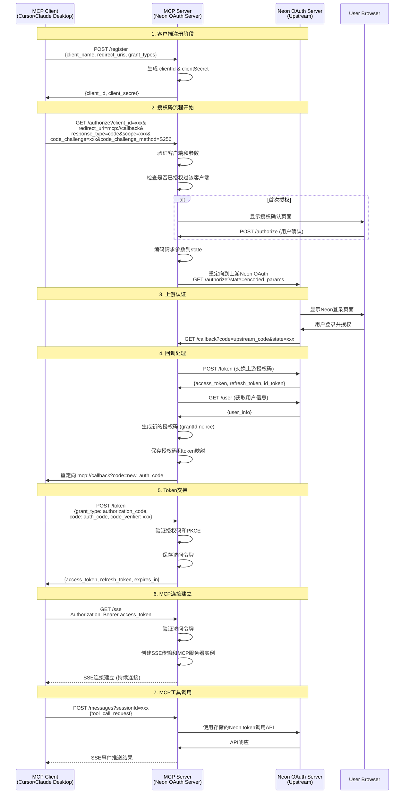
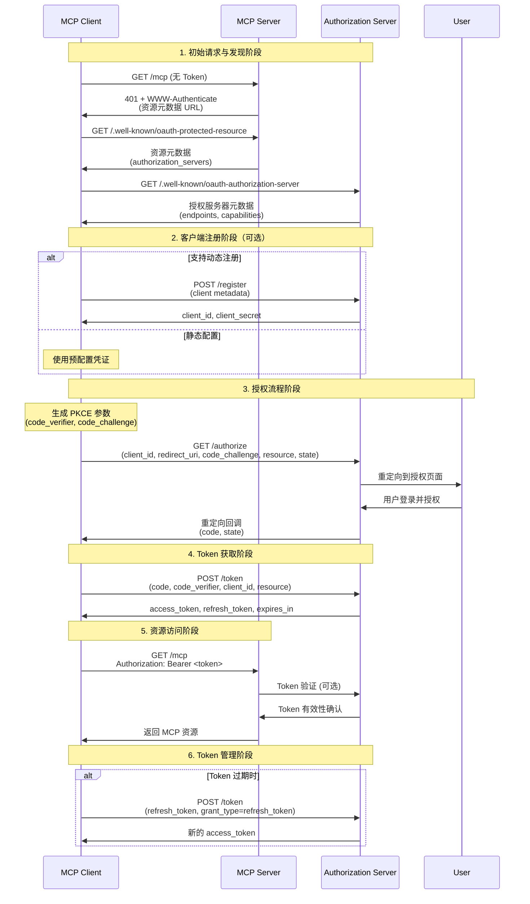
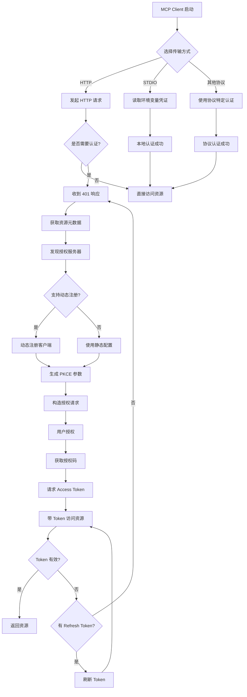
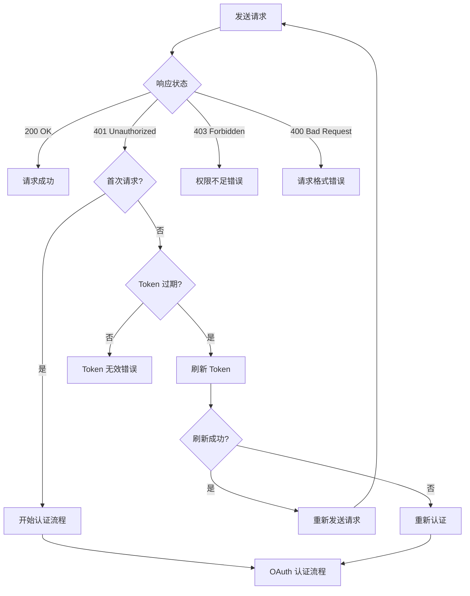
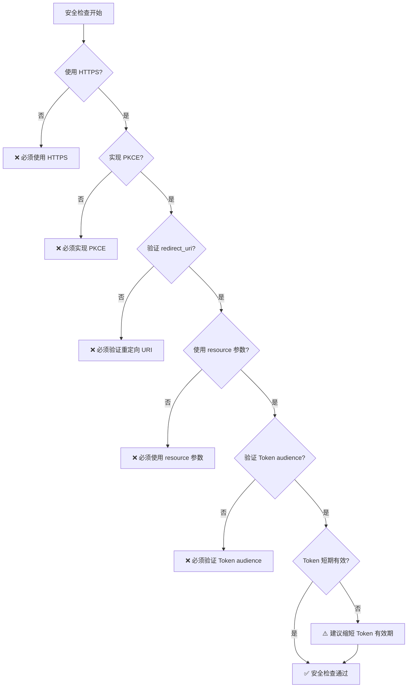

# 大致流程

- AvatarAI: OAuth Client + MCP Client
  - redirect url


# Neon OAuth


# MCP 完整认证流程图

## 流程时序图




## 决策流程图



## 错误处理流程



## 安全检查清单



# Github MCP Server OAuth

```
sequenceDiagram
    participant B as User-Agent (Browser)
    participant C as Client
    participant M as MCP Server (Resource Server)
    participant A as Authorization Server

    C->>M: MCP request without token
    M->>C: HTTP 401 Unauthorized with WWW-Authenticate header
    Note over C: Extract resource_metadata URL from WWW-Authenticate

    C->>M: Request Protected Resource Metadata
    M->>C: Return metadata

    Note over C: Parse metadata and extract authorization server(s)<br/>Client determines AS to use

    C->>A: GET /.well-known/oauth-authorization-server
    A->>C: Authorization server metadata response

    alt Dynamic client registration
        C->>A: POST /register
        A->>C: Client Credentials
    end

    Note over C: Generate PKCE parameters
    C->>B: Open browser with authorization URL + code_challenge
    B->>A: Authorization request
    Note over A: User authorizes
    A->>B: Redirect to callback with authorization code
    B->>C: Authorization code callback
    C->>A: Token request + code_verifier
    A->>C: Access token (+ refresh token)
    C->>M: MCP request with access token
    M-->>C: MCP response
    Note over C,M: MCP communication continues with valid token
```

github oauth apps
Ov23liXZ68YbB4ILHsyg
a7c79cea7177603c833e8b310736a81a8d033f6b


twitter oauth


export MCP_GITHUB_GITHUB_CLIENT_ID="Ov23liXZ68YbB4ILHsyg"
export MCP_GITHUB_GITHUB_CLIENT_SECRET="a7c79cea7177603c833e8b310736a81a8d033f6b"